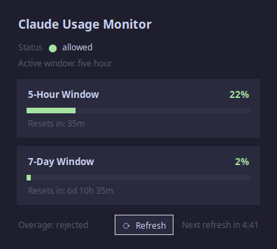
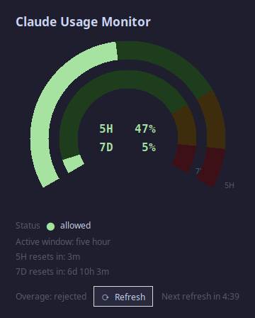

# Claude Tools

Utilities for monitoring Claude API usage. Credentials are read automatically from Claude Code — no separate API key setup needed.

## Setup

```bash
python3 -m venv venv
source venv/bin/activate
pip install -r requirements.txt
```

`tkinter` is a system package and must be installed separately:

```bash
sudo apt install python3-tk   # Debian/Ubuntu
```

---

## scripts/claudeUsage.py

Command-line tool that reports your current Claude rate limit status. Makes a minimal API call (1 token) and reads the response headers.

### Usage

```bash
python3 scripts/claudeUsage.py
```

### Credentials

- **macOS** — reads the OAuth token from the system keychain (service `Claude Code-credentials`)
- **Linux/other** — reads from `~/.claude/.credentials.json`

### Output

```json
{
    "5h_pct": 12,
    "5h_reset_min": 118,
    "5h_status": "allowed",
    "7d_pct": 2,
    "7d_reset_min": 9358,
    "7d_status": "allowed",
    "active_window": "five_hour",
    "ok": true,
    "overage_status": "rejected",
    "status": "allowed"
}
```

| Field | Description |
|---|---|
| `status` | Overall rate limit state: `allowed`, `throttled`, or `blocked` |
| `active_window` | Which window is currently the binding constraint: `five_hour` or `seven_day` |
| `overage_status` | Whether token overages are available (`rejected` = disabled at org level) |
| `5h_pct` | Percent of the 5-hour token budget consumed |
| `5h_reset_min` | Minutes until the 5-hour window resets |
| `5h_status` | Status for the 5-hour window |
| `7d_pct` | Percent of the 7-day token budget consumed |
| `7d_reset_min` | Minutes until the 7-day window resets |
| `7d_status` | Status for the 7-day window |
| `ok` | `true` if the API call succeeded |

Anthropic exposes two rate limit windows. `active_window` tells you which one is currently the tighter constraint.

---

## scripts/claudeUsageGUI.py

Graphical desktop app showing the same rate limit information. Updates automatically every 5 minutes with a live countdown; click **⟳ Refresh** to update immediately.



### Usage

```bash
python3 scripts/claudeUsageGUI.py
```

Or run directly (executable bit is set):

```bash
scripts/claudeUsageGUI.py
```

### Options

```
--refresh SEC   auto-refresh interval in seconds (default 300)
```

### Display

The window shows:

- **Status** — overall rate limit state with a colour indicator (green / yellow / red)
- **Active window** — which budget is currently the binding constraint
- **5-Hour Window** — progress bar, percentage used, and time until reset
- **7-Day Window** — progress bar, percentage used, and time until reset
- **Overage** — whether token overages are available
- **Countdown** — seconds until the next automatic refresh

Progress bars and percentages are coloured green (< 50%), yellow (50–80%), or red (> 80%).

### Credentials

Same as `claudeUsage.py` — reads from the Claude Code credential store automatically.

---

## scripts/claudeUsageDialGUI.py

Alternative graphical display using two concentric dial gauges instead of progress bars. Outer ring = 5-hour window, inner ring = 7-day window. Same auto-refresh and manual refresh behaviour as `claudeUsageGUI.py`.



### Usage

```bash
python3 scripts/claudeUsageDialGUI.py
```

Or run directly (executable bit is set):

```bash
scripts/claudeUsageDialGUI.py
```

### Options

```
--refresh SEC   auto-refresh interval in seconds (default 300)
--green PCT     upper bound of green zone (default 75)
--amber PCT     upper bound of amber zone (default 90)
```

All three options are independent and can be combined:

```bash
scripts/claudeUsageDialGUI.py --refresh 60 --green 60 --amber 80
```

### Display

Each ring sweeps 240° from lower-left to lower-right through the top. The arc is divided into three colour zones:

| Zone | Range | Colour |
|---|---|---|
| Normal | 0 – `--green` % | Green |
| Warning | `--green` – `--amber` % | Amber |
| Critical | `--amber` – 100 % | Red |

The lit portion of each ring shows current usage; the remainder of the arc is shown as a dim background so zone boundaries are always visible. Current percentages are displayed in the centre. Reset times, status, active window, and overage state appear below the dial.

### Credentials

Same as `claudeUsage.py` — reads from the Claude Code credential store automatically.
